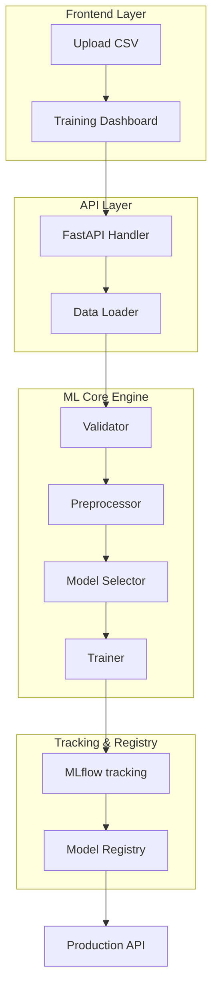

# 🚀 One-Click ML Pipeline Builder

A powerful, full-stack automated machine learning platform that allows you to upload a dataset and get a trained model with a single click. This project combines a high-performance **FastAPI** backend with a premium **React** frontend to democratize the ML workflow.


---

## ✨ Features

### 🖥️ Premium Frontend
- **Aesthetic UI**: Modern SaaS-style dashboard with glassmorphism and dark mode.
- **Micro-animations**: Smooth transitions and interactive elements using **Framer Motion**.
- **Drag & Drop**: Intuitive CSV uploader with real-time file validation.
- **Dynamic Dashboard**: Visual feedback on training progress and model performance.

### ⚙️ Intelligent Backend
- **Auto-Task Detection**: Automatically identifies if your data requires Classification or Regression.
- **Smart Training**: Optimized training pipeline using Scikit-Learn.
- **Experiment Tracking**: Full lifecycle management with **MLflow** integration.
- **Robust API**: RESTful endpoints built with FastAPI.

### 🛠️ DevOps & Infrastructure
- **Data Versioning**: Integrated with **DVC** for reproducible datasets.
- **Containerized**: Production-ready **Docker** configuration.
- **CI/CD**: Automated GitHub Actions workflow for testing and deployment validation.

---

## 🏗️ Project Structure

```text
one-click-ml-pipeline/
├── app/                # FastAPI Application (API Layer)
├── frontend/           # React + Vite + Tailwind (UI Layer)
├── src/                # Core ML Engine
│   ├── trainer.py      # Model training logic
│   ├── validator.py    # Data & Task validation
│   ├── data_loader.py  # DVC-integrated loading
│   └── registry.py     # Model versioning
├── data/               # Local data storage (DVC tracked)
├── models/             # Compiled model artifacts
└── .github/workflows/  # CI/CD Pipelines
```

---

## 🔄 Pipeline Workflow



**Text Representation:**
```text
[ Data Upload ] ──▶ [ API Layer ] ──▶ [ Validator ] ──▶ [ Preprocessor ]
                                                              │
                                                              ▼
[ Production ] ◀── [ Registry ] ◀── [ MLflow ] ◀── [ Model Trainer ]
```

---

## 🚀 Getting Started

### 1. Backend Setup
```bash
# Clone the repository
git clone https://github.com/your-username/one-click-ml-pipeline.git
cd one-click-ml-pipeline

# Create virtual environment
python -m venv venv
source venv/bin/activate  # Or `.\venv\Scripts\activate` on Windows

# Install dependencies
pip install -r requirements.txt

# Start the API server
uvicorn app.main:app --reload
```

### 2. Frontend Setup
```bash
cd frontend

# Install dependencies
npm install

# Run dev server
npm run dev
```

### 3. Track Experiments
Open a new terminal and run:
```bash
mlflow ui
```
Visit `http://localhost:5000` to see your training logs and metrics.

---

## 🛠️ Technology Stack

| Layer | Technology |
| :--- | :--- |
| **Frontend** | React 19, Vite, TailwindCSS, Framer Motion, Lucide React |
| **Backend** | FastAPI, Python 3.10+, Uvicorn |
| **ML Engine** | Scikit-Learn, Pandas, MLflow |
| **Data/DevOps**| DVC, Docker, GitHub Actions |

---

## 📝 License

Distributed under the MIT License. See `LICENSE` for more information.

---

## 🤝 Contributing

Contributions are what make the open-source community such an amazing place to learn, inspire, and create. Any contributions you make are **greatly appreciated**.

1. Fork the Project
2. Create your Feature Branch (`git checkout -b feature/AmazingFeature`)
3. Commit your Changes (`git commit -m 'Add some AmazingFeature'`)
4. Push to the Branch (`git push origin feature/AmazingFeature`)
5. Open a Pull Request
