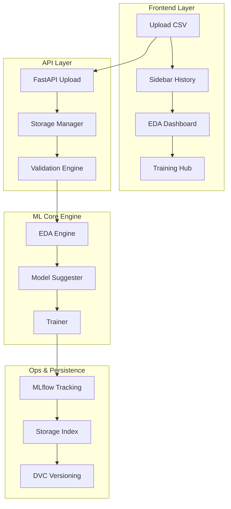

# 🚀 One-Click ML Pipeline Builder

A powerful, full-stack automated machine learning platform that allows you to upload a dataset, explore insights, and train models with a single click. This project combines a high-performance **FastAPI** backend with a premium **React** frontend to democratize the ML workflow.


---

## ✨ Features

### 🖥️ Premium Frontend
- **Aesthetic UI**: Modern SaaS-style dashboard with glassmorphism and dark mode.
- **Micro-animations**: Smooth transitions and interactive elements using **Framer Motion**.
- **Intuitive Sidebar**: Access your project history and reload past sessions instantly.
- **Dynamic Dashboard**: Visual feedback on EDA metrics, training progress, and model performance.

### ⚙️ Intelligent Backend
- **Project Persistence**: Local-first storage system handles multiple user projects without a complex database.
- **Auto-Task Validation**: Ensures your target column and selected ML task (Classification/Regression) are aligned.
- **Smart Model Suggestions**: Recommends the best algorithms specifically for your dataset characteristics.
- **Advanced EDA**: Automatically generates comprehensive statistical reports and visuals.
- **Experiment Tracking**: Full lifecycle management with **MLflow** integration.

### 🛠️ DevOps & Infrastructure
- **Data Versioning**: Integrated with **DVC** for reproducible datasets.
- **Containerized**: Production-ready **Docker** configuration.
- **CI/CD**: Automated GitHub Actions workflow for testing and deployment validation.

---

## 🏗️ Project Structure

```text
one-click-ml-pipeline/
├── app/                  # FastAPI Application (API Layer)
│   └── main.py           # API Endpoints & Logic
├── frontend/             # React + Vite + Tailwind (UI Layer)
│   ├── src/components/   # Reusable UI Components (Sidebar, Navbar, etc.)
│   └── src/pages/        # Dashboard, EDA, Training, and Report Pages
├── src/                  # Core ML Engine
│   ├── trainer.py        # Model training logic
│   ├── storage_manager.py# Project & file persistence
│   ├── history_manager.py# Meta-data & session history
│   ├── eda_engine.py     # Automated EDA generation
│   └── model_suggester.py# Intelligent algorithm selection
├── data/                 # Local data storage (DVC tracked)
├── models/               # Compiled model artifacts (.pkl)
├── storage/              # Persistent project data (JSON/Files)
└── .github/workflows/    # CI/CD Pipelines
```

---

## 🔄 Pipeline Workflow



---

## 🚀 Getting Started

### 1. Backend Setup
```bash
# Clone the repository
git clone https://github.com/your-username/one-click-ml-pipeline.git
cd one-click-ml-pipeline

# Create virtual environment
python -m venv venv
source venv/bin/activate  # Or `.\venv\Scripts\activate` on Windows

# Install dependencies
pip install -r requirements.txt

# Start the API server
uvicorn app.main:app --reload
```

### 2. Frontend Setup
```bash
cd frontend

# Install dependencies
npm install

# Run dev server
npm run dev
```

### 3. Track Experiments
Open a new terminal and run:
```bash
mlflow ui
```
Visit `http://localhost:5000` to see your training logs, metrics, and parameters in detail.

---

## 🛠️ Technology Stack

| Layer | Technology |
| :--- | :--- |
| **Frontend** | React 19, Vite, TailwindCSS, Framer Motion, Lucide React |
| **Backend** | FastAPI, Python 3.10+, Uvicorn, Pydantic |
| **ML Engine** | Scikit-Learn, Pandas, MLflow, XGBoost |
| **Data/DevOps**| DVC, Docker, GitHub Actions |

---

## 📝 License

Distributed under the MIT License. See `LICENSE` for more information.

---

## 🤝 Contributing

1. Fork the Project
2. Create your Feature Branch (`git checkout -b feature/AmazingFeature`)
3. Commit your Changes (`git commit -m 'Add some AmazingFeature'`)
4. Push to the Branch (`git push origin feature/AmazingFeature`)
5. Open a Pull Request
