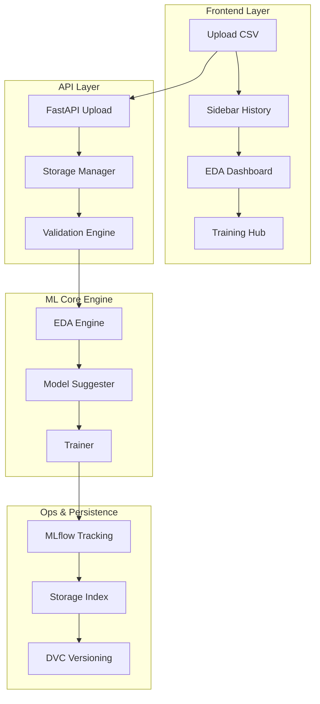

# 🚀 One-Click ML Pipeline Builder

A powerful, full-stack automated machine learning platform that allows you to upload a dataset, explore insights, and train models with a single click. This project combines a high-performance **FastAPI** backend with a premium **React** frontend to democratize the ML workflow.


---

## ✨ Features

### 🖥️ Premium Frontend
- **Aesthetic UI**: Modern SaaS-style dashboard with glassmorphism and dark mode.
- **Micro-animations**: Smooth transitions and interactive elements using **Framer Motion**.
- **Intuitive Sidebar**: Access your project history and reload past sessions instantly.
- **Dynamic Dashboard**: Visual feedback on EDA metrics, training progress, and model performance.

### ⚙️ Intelligent Backend
- **Project Persistence**: Local-first JSON-based storage system manages multiple user projects without external databases.
- **Auto-Task Validation**: Validates dataset integrity and ensures target column aligns with ML task (Classification/Regression).
- **Smart Model Suggestions**: Recommends optimal algorithms based on task type and dataset characteristics.
- **Advanced EDA**: Auto-generates Plotly-based statistical reports with correlation matrices, distributions, and missing value analysis.
- **Experiment Tracking**: Full MLflow integration for tracking metrics, parameters, and model artifacts.
- **Model Registry & Promotion**: Manage trained models and promote to production with version control.

### 🛠️ DevOps & Infrastructure
- **Data Versioning**: Integrated with **DVC** for reproducible datasets.
- **Containerized**: Production-ready **Docker** configuration.
- **CI/CD**: Automated GitHub Actions workflow for testing and deployment validation.

---

## 🏗️ Project Structure

```text
one-click-ml-pipeline/
├── app/
│   └── main.py                    # FastAPI endpoints (upload, train, predict, EDA, etc.)
├── frontend/                      # React + Vite + Tailwind UI
│   ├── src/components/            # UI Components (FileUpload, Sidebar, Navbar, ResultsCard, etc.)
│   ├── src/pages/                 # Page components (Dashboard, EDAPage, TrainingPage, ReportPage)
│   ├── src/context/               # PipelineContext for state management
│   ├── src/services/              # API client (api.js)
│   └── vite.config.js             # Build configuration
├── src/                           # Core ML Engine
│   ├── trainer.py                 # Model training orchestration
│   ├── validator.py               # Dataset & task validation
│   ├── eda_engine.py              # Plotly-based EDA report generation
│   ├── model_suggester.py         # Algorithm recommendation engine
│   ├── model_selector.py          # Model selection utilities
│   ├── predictor.py               # Model inference layer
│   ├── storage_manager.py         # Project persistence (JSON storage)
│   ├── history_manager.py         # Project metadata & session tracking
│   ├── registry.py                # MLflow model registry integration
│   ├── preprocessor.py            # Data preprocessing
│   ├── data_loader.py             # Data I/O utilities
│   └── config.py                  # Configuration settings
├── pipelines/                     # Pipeline stage definitions
│   ├── eda_stage.py
│   ├── preprocessing_stage.py
│   ├── training_stage.py
│   └── validation_stage.py
├── data/                          # Dataset storage (DVC tracked)
├── storage/                       # Project persistence (JSON indices & datasets)
├── mlruns/                        # MLflow experiment runs
├── mlartifacts/                   # MLflow model artifacts
├── dvc.yaml                       # DVC pipeline configuration
├── Dockerfile                     # Container configuration
└── requirements.txt               # Python dependencies
```

---

## 🔄 Pipeline Workflow


```mermaid
graph TD
    subgraph UI_Layer [Frontend Layer]
        A[Upload CSV] --> B[Sidebar History]
        B --> C[EDA Dashboard]
        C --> D[Training Hub]
    end

    subgraph API_Layer [API Layer]
        A --> E[FastAPI Upload]
        E --> F[Storage Manager]
        F --> G[Validation Engine]
    end

    subgraph ML_Core [ML Core Engine]
        G --> H[EDA Engine]
        H --> I[Model Suggester]
        I --> J[Trainer]
    end

    subgraph Tracking_Persistence [Ops & Persistence]
        J --> K[MLflow Tracking]
        K --> L[Storage Index]
        L --> M[DVC Versioning]
    end
```

---

## 🚀 Getting Started

### 1. Backend Setup
```bash
# Clone the repository
git clone https://github.com/your-username/one-click-ml-pipeline.git
cd one-click-ml-pipeline

# Create virtual environment
python -m venv venv
source venv/bin/activate  # Or `.\venv\Scripts\activate` on Windows

# Install dependencies
pip install -r requirements.txt

# Start the API server
uvicorn app.main:app --reload
```

### 2. Frontend Setup
```bash
cd frontend

# Install dependencies
npm install

# Run dev server
npm run dev
```

### 3. Run the Application

The frontend will be available at `http://localhost:5173` and the backend at `http://localhost:8000`.

### 4. Track Experiments (Optional)

Open a new terminal and run MLflow UI:
```bash
mlflow ui
```
Visit `http://localhost:5000` to view training logs, metrics, parameters, and model artifacts.

---

## 🛠️ Technology Stack

| Layer | Technology |
| :--- | :--- |
| **Frontend** | React 19, Vite, TailwindCSS, Framer Motion, Lucide React, Plotly.js, React Router |
| **Backend** | FastAPI, Uvicorn, Pydantic, Python 3.10+ |
| **ML Models** | Scikit-Learn, XGBoost, Pandas, NumPy, Joblib |
| **Visualization** | Plotly (EDA Reports), Seaborn, Matplotlib |
| **Experiment Tracking** | MLflow (metrics, parameters, artifacts, model registry) |
| **DevOps** | DVC (data versioning), Docker, python-multipart |
| **Data Processing** | Pandas, NumPy, Scikit-Learn preprocessing |

---

## � API Endpoints

| Method | Endpoint | Description |
| :--- | :--- | :--- |
| **POST** | `/upload` | Upload CSV, specify task type & target column |
| **GET** | `/projects` | List all project history |
| **GET** | `/project/{project_id}` | Load specific project with EDA & results |
| **DELETE** | `/project/{project_id}` | Delete a project |
| **GET** | `/eda` | Generate EDA report for current dataset |
| **GET** | `/model-suggestions` | Get recommended models for task |
| **POST** | `/train` | Train a model with specified model_id |
| **POST** | `/predict` | Make predictions using a trained model |
| **POST** | `/promote` | Promote model to production in registry |

---

## 🤖 Supported Models

### Classification
- Logistic Regression
- Random Forest Classifier
- XGBoost Classifier

### Regression
- Linear Regression
- Random Forest Regressor
- Gradient Boosting Regressor

---

## �📝 License

Distributed under the MIT License. See `LICENSE` for more information.

---

## 🤝 Contributing

1. Fork the Project
2. Create your Feature Branch (`git checkout -b feature/AmazingFeature`)
3. Commit your Changes (`git commit -m 'Add some AmazingFeature'`)
4. Push to the Branch (`git push origin feature/AmazingFeature`)
5. Open a Pull Request
